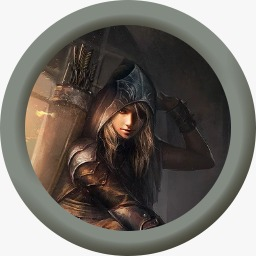

# Goda McCormick
  
  
- [Goda McCormick](#goda-mccormick )
- [Health](#health )
  - [Armor Class 14](#armor-class-14 )
  - [Death Saves](#death-saves )
- [Abilities](#abilities )
  - [Alignment](#alignment )
- [Skills](#skills )
- [Weapons](#weapons )
- [Armor](#armor )
- [Movement](#movement )
- [Inventory](#inventory )
  - [Quiver](#quiver )
  - [Bag of Holding](#bag-of-holding )
- [Wallet](#wallet )
- [Spells](#spells )
- [Class Features](#class-features )
  - [Bard Features PHB, pg.52](#bard-features-phb-pg52 )
    - [Spellcasting PHB, pg. 52](#spellcasting-phb-pg-52 )
    - [Bardic Inspiration PHB, pg. 53](#bardic-inspiration-phb-pg-53 )
    - [Jack of All Trades PHB, pg. 54](#jack-of-all-trades-phb-pg-54 )
    - [Song of Rest PHB, pg. 54](#song-of-rest-phb-pg-54 )
    - [Psychic blades XGE](#psychic-blades-xge )
    - [Whispers of terror XGE](#whispers-of-terror-xge )
  - [Rogue Features](#rogue-features )
    - [Sneak Attack  PHB, pg. 96](#sneak-attack--phb-pg-96 )
    - [Thieves’ Cant PHB, pg. 96](#thieves-cant-phb-pg-96 )
    - [Cunning Action PHB, pg. 96](#cunning-action-phb-pg-96 )
    - [Fast Hands PHB, pg. 97](#fast-hands-phb-pg-97 )
    - [Second-Story Work PHB, pg. 97](#second-story-work-phb-pg-97 )
- [Racial Traits](#racial-traits )
    - [Gnome Cunning BR, pg. 37](#gnome-cunning-br-pg-37 )
    - [Superior Darkvision EE](#superior-darkvision-ee )
    - [Stone Camouflage EE](#stone-camouflage-ee )
    - [Svirfneblin magic EE](#svirfneblin-magic-ee )
- [Traits](#traits )
  - [Personality](#personality )
  - [Ideals](#ideals )
  - [Bonds](#bonds )
  - [Flaws](#flaws )
- [Appearance](#appearance )
- [Backstory](#backstory )
- [Party](#party )
  - [Auren](#auren )
    - [Alignment](#alignment-1 )
    - [Health](#health-1 )
      - [Death Saves](#death-saves-1 )
    - [Abilities](#abilities-1 )
    - [Inventory](#inventory-1 )
  - [Burnhard Edward Toast](#burnhard-edward-toast )
    - [Alignment](#alignment-2 )
    - [Health](#health-2 )
      - [Death Saves](#death-saves-2 )
    - [Abilities](#abilities-2 )
    - [Inventory](#inventory-2 )
  - [Fireplum](#fireplum )
    - [Alignment](#alignment-3 )
    - [Health](#health-3 )
      - [Death Saves](#death-saves-3 )
    - [Abilities](#abilities-3 )
    - [Inventory](#inventory-3 )
  - [Cous](#cous )
    - [Alignment](#alignment-4 )
    - [Health](#health-4 )
      - [Death Saves](#death-saves-4 )
    - [Abilities](#abilities-4 )
    - [Inventory](#inventory-4 )
  
# Health
  
| Max | Current | Temp |
| --- | ------- | ---- |
| 28  | 28      |
  
## Armor Class 14
  
## Death Saves
  
| Fails | Saves |
| ----- | ----- |
| O     | O     |
| O     | O     |
| O     | O     |
  
  
# Abilities
  
| Name         | Proficiency | Modifier |
| ------------ | ----------- | -------- |
| STRength     | 9           | -1       |
| DEXterity    | 17          | 3        |
| CONstitution | 10          | 0        |
| INTelegance  | 17          | 3        |
| WISdom       | 11          | 0        |
| CHArisma     | 14          | 2        |
  
Proficiency bonus +3
  
  
| Attribute  | Value        |
| ---------- | ------------ |
| Rogue      | 3            |
| Bard       | 3            |
| Race       | Deep gnome   |
| Background | criminal-Spy |
| Collage    | Whispers     |
| Gender     | Male         |
| Age        | 180          |
| Height     | 3'1"         |
| Weight     | 42           |
| Skin       | Pale         |
| Eye        | Deep blue    |
| Hair       | Auburn       |
  
## Alignment
  
| X       | Lawful | Neutral | Chaotic |
| ------- | ------ | ------- | ------- |
| Good    |        |         |
| Neutral |        |         | X       |
| Evil    |        |         |         |
  
  
# Skills
  
| Proficiency | Bonus | Name            | MOD |
| ----------- | ----- | --------------- | --- |
| Half        | 4     | Acrobatics      | DEX |
| Half        | 1     | Animal Handling | WIS |
| Half        | 4     | Arcana          | INT |
| Half        | 0     | Athletics       | STR |
| Expert      | 8     | Deception       | CHA |
| Half        | 4     | History         | INT |
| Half        | 1     | Insight         | WIS |
| Proficient  | 5     | Intimidation    | CHA |
| Half        | 4     | Investigation   | INT |
| Half        | 1     | Medicine        | WIS |
| Half        | 4     | Nature          | INT |
| Expert      | 6     | Perception      | WIS |
| Half        | 3     | Performance     | CHA |
| Proficient  | 5     | Persuasion      | CHA |
| Half        | 4     | Religion        | INT |
| Expert      | 9     | Slight of Hand  | DEX |
| Expert      | 9     | Stealth         | DEX |
| Proficient  | 3     | Survival        | WIS |
  
  
# Weapons
  
| Name      | Hit | Damage | Type        | Range    | QTY |
| --------- | --- | ------ | ----------- | -------- | --- |
| Dagger    | +6  | 1D4 +3 | Piercing    | 20 / 60  | 2   |
| Rapier    | +6  | 1D8 +3 | Piercing    | 5        | 1   |
| Short bow | +6  | 1D6 +3 | Piercing    | 80 / 320 | 1   |
| Fist      | +2  | 0      | Bludgeoning | 5        | 2   |
  
  
# Armor
  
| Type    | Armor class | Cost | Weight |
| ------- | ----------- | ---- | ------ |
| Leather | 11 + DEX    | 10   | 10     |
  
  
# Movement
  
speed 25
  
  
  
  
  
  
  
  
  
| weight | state          |
| ------ | -------------- |
| 67     | encumbered     |
| 135    | push/drag/lift |
  
  
# Inventory
  
| QTY | name            | weight(lb.) | cost(gp) |
| --- | --------------- | ----------- | -------- |
| 1   | Signal Whistle  |             | 0.05     |
| 1   | Signet ring     |             | 5        |
| 1   | Poison DC10 d4  |             | 100      |
| 2   | Thieves Tools   | 2           |          |
| 10  | wood rings      |             |          |
| 10  | twine rings     |             |          |
| 1   | banjo           |             |          |
| 1   | flat cap        |             |          |
| 1   | harmonica       |             |          |
| 1   | Leather armor   | 10          | 10       |
| 2   | Dagger          | 2           | 4        |
| 1   | Rapier          | 2           | 25       |
| 1   | Short bow       | 2           | 25       |
  
## Quiver
  
weigh's 1lb.
  
| QTY | name   | weight(lb.) | cost(gp) |
| --- | ------ | ----------- | -------- |
| 16  | Arrows | 0.8         |          |
  
## Bag of Holding
  
weigh's 15lb. can carry 500lb. '
  
| QTY  | name               | weight(lb.) | cost(gp) |
| ---- | ------------------ | ----------- | -------- |
| 4    | 10XArrows          | 2           |          |
| 0    | Health 10hp        |             |          |
| 0    | Health 20hp        |             |          |
| 1000 | Ball bearings      | 2           | 1        |
| 1    | Crowbar            | 5           | 2        |
| 1    | Lantern hooded     | 2           | 5        |
| 2    | Oil (flask)        | 2           | 0.2      |
| 1    | Little bag of sand |             |          |
| 1    | Magnifying glass   |             | 100      |
| 5    | Candle             |             | 0.05     |
| 2    | Paper              |             | 0.4      |
| 1    | Ink                | 1 oz        | 10       |
| 1    | Ink Pen            |             | 0.02     |
| 20   | Caltrops           | 2           |          |
| 1    | Block and tackle   | 5           |          |
| 1    | Grappling hook     | 4           | 2        |
| 10   | Piton              | 2.5         | 0.5      |
| 2    | Rope, silk (50ft)  | 10          | 20       |
| 10   | String 10ft        |             |          |
| 1    | Bedroll            | 7           | 1        |
| 1    | Water skin         | 5           | 0.2      |
| 1    | Tinder box         | 1           | 0.5      |
| 1    | Whetstone          | 1           | 0.01     |
  
  
# Wallet
  
| money    | amount |
| -------- | ------ |
| copper   | 0      |
| silver   | 0      |
| electrum | 0      |
| gold     | 90     |
| Platinum | 0      |
  
  
# Spells
  
- Spell casting class Bard
- Spell casting ability CHA
- Spell save DC 13
- Spell attack bonus +5
  
| Level   | Spell name     | Source | Time   | Range        | Component         | Duration             | Notes           | Ref |
| ------- | -------------- | ------ | ------ | ------------ | ----------------- | -------------------- | --------------- | --- |
| Cantrip | Mage hand      | Bard   | Action | 30           | V,S               | 1 Min                | 10 lb max       | 256 |
| Cantrip | Minor illusion | Bard   | Action | 30 / 5 cube  | S,Fleece          | 1 Min                |                 | 260 |
| Cantrip | True strike    | Bard   | Action | 30           | S                 | Concentration        | ADV next attack | 284 |
| 1       | Cure wounds    | Bard   | Action | Touch        | V,S               | Instant              | 1D8+CHA         | 230 |
| 1       | Healing word   | Bard   | Bonus  | 60           | V                 | Instant              | 1D4+CHA         | 250 |
| 1       | Silent image   | Bard   | Action | 60 / 15      | V,S,Fleece        | Concentration <10min |                 | 276 |
| 1       | Unseen servant | Bard   | Action | 60           | V,S,String,wood   | 1 Hour               | 10AC 1HP 2STR   | 284 |
| 1       | Feather fall   | Bard   | Action | 60           | V, feather        | 1 Min                | 5 creatures     | 239 |
| 1 svir  | Disguise self  | Bard   | Action | Self         | V,S               | 1 Hour               |                 | 233 |
| 2       | Cure wounds    | Bard   | Action | Touch        | V,S               | Instant              | 2D8+CHA         | 230 |
| 2       | Healing word   | Bard   | Bonus  | 60           | V                 | Instant              | 2D4+CHA         | 250 |
| 2       | Silence        | Bard   | Action | 120 / 20 sph | V,S               | Concentration <10min |                 | 275 |
| 2 svir  | blind/deafness | Bard   | Action | 30           | V                 | 1 Min                | Con 14 save     | 219 |
| 2 svir  | Blur           | Bard   | Action | Self         | V                 | Concentration <1min  |                 | 219 |
| 3 svir  | Nondetection   | Bard   | Action | Touch        | V,S, no M as svir | 8 Hours              | 10ft max        | 263 |
  
  
# Class Features
  
## Bard Features PHB, pg.52
  
### Spellcasting PHB, pg. 52
  
You can cast known bard spells using CHA as your spellcasting modifier (**Spell DC 13, Spell Attack +5**) and known bard spells as rituals if they have the ritual tag. You can use a musical instrument as a spellcasting focus.
  
### Bardic Inspiration PHB, pg. 53
  
As a **bonus action**, a creature (other than you) within **60 ft.** that can hear you gains an inspiration die (**1d6**). For **10** minutes, the creature can add it to one ability check, attack roll, or saving throw. This can be added after seeing the roll, but before knowing the outcome. **2/Long Rest**
  
### Jack of All Trades PHB, pg. 54
  
You can add half your proficiency bonus, rounded down ( +1 ), to any ability check you make that doesn’t already include it.
  
### Song of Rest PHB, pg. 54
  
If you or any friendly creatures who can hear your performance regain hit points at the end of the short rest by spending one or more Hit Dice, each of those creatures regains an extra **1d6** hit points.
  
### Psychic blades XGE
  
When you hit a creature with a weapon attack, you can expend one use of your Bardic Inspiration to deal an additional **2d6** psychic damage to that target. Once per round on your turn.
  
### Whispers of terror XGE
  
If you speak to a humanoid alone for at least **1** minute at the end of the conversation, the target must succeed on a **Wisdom** saving throw against your **spell save DC** or be frightened of you or another creature of your choice. The target is frightened in this way for 1 hour, until it is attacked or damaged, or until it witnesses its allies being attacked or damaged.
Once per short rest or long rest.
  
## Rogue Features
  
### Sneak Attack  PHB, pg. 96
  
Once per turn, you can deal an extra **2d6** damage to one creature you hit with an attack with a finesse or ranged weapon if you have advantage on the attack roll. You don’t need advantage on the attack roll if another enemy of the target is within 5 ft. of it, that enemy isn’t incapacitated, and you don’t have disadvantage on the attack roll.
  
### Thieves’ Cant PHB, pg. 96
  
You have learned thieves’ cant, a secret mix of dialect, jargon, and code that allows you to hide messages in seemingly normal conversation. It takes **four times longer** to convey such a message than it does to speak the same idea plainly.
  
### Cunning Action PHB, pg. 96
  
You can take a **bonus action** on each of your turns to take the Dash, Disengage, or Hide action.
  
### Fast Hands PHB, pg. 97
  
You can use the **bonus action** granted by your Cunning Action to make a Sleight of Hand check, use your thieves’ tools to disarm a trap or open a lock, or take the Use an Object action.
  
### Second-Story Work PHB, pg. 97
  
Climbing no longer costs you extra movement, and when you make a running jump, the distance you cover increases by **3 ft.**.
  
# Racial Traits
  
### Gnome Cunning BR, pg. 37
  
You have advantage on all **Intelligence, Wisdom, and Charisma** saving throws against **magic**.
  
### Superior Darkvision EE
  
Your darkvision has a radius of 120 feet.
  
### Stone Camouflage EE
  
You have advantage on Dexterity (Stealth) checks to hide in rocky terrain.
  
### Svirfneblin magic EE
  
You can cast nondetection on yourself **at will**, without needing a material component. You can also cast each of the following spells once with this ability: **blindness/deafness, blur, and disguise self**. You regain the ability to cast these spells when you finish a **long rest**.
Intelligence is your spellcasting ability for these spells, and you cast them at their lowest possible levels.
  
  
# Traits
  
## Personality
  
I am always calm since I don’t pay attention to the risks in a situation. Never tell me the odds as ill always take them.
  
## Ideals
  
Freedom. Chains are meant to be broken, as are those who would forge them. (Chaotic)
  
## Bonds
  
I’m trying to pay off an old debt I owe to a generous benefactor.
  
## Flaws
  
If there’s a plan, I’ll forget it. If I don’t forget it, I’ll ignore it.
  
  
# Appearance
  

  
The short gnome was a striking figure, with his pale complexion and deep blue eyes that seemed to sparkle even in the dimmest light. His dark auburn hair was usually kept short and tidy, framing his face in a way that drew attention to his stunning eyes.
  
He was often seen wearing dark glasses, which he used to hide his glass eye, a constant reminder of the danger and violence he had left behind. His attire was a mishmash of styles, combining a flat cap with tattered armor and an assassin's hooded robe. It was clear that he had seen some tough times and had been forced to improvise with whatever he had on hand.
  
He could often be found busking on street corners and inns to earn his keep
  
  
# Backstory
  
As a young rogue, Goda had a rough start in life. Growing up on the streets, he learned early on how to pick pockets and sneak around unnoticed. However, his life of crime came to a halt when he was caught attempting to rob an old man. The old man, who happened to be a retired assassin, saw potential in the young thief and offered him an apprenticeship.
  
Goda spent several years learning the art of assassination and thievery under the tutelage of the old man. Despite his criminal past, he found himself drawn to the old man's wisdom and skill, and began to see a life beyond the shadows of thievery and deception.
  
Their final job together went wrong, and the old man was gravely wounded. Goda tried to help him escape, but they were separated during their escape. Goda was left with a serious injury - an arrow lodged in his eye. He woke up alone, without the old man or any sign of his whereabouts, and had to make his way out of the
  
  
  
# Party
  
  
  
## Auren

  
| Attribute | Value      |
| --------- | ---------- |
| class     | wizard     |
| Race      | Astral elf |
| Gender    | female     |
| Age       | ?          |
| Height    | ?          |
| Weight    | ?          |
| Skin      | ?          |
| Eye       | ?          |
| Hair      | ?          |
  
### Alignment
  
| X       | Lawful | Neutral | Chaotic |
| ------- | ------ | ------- | ------- |
| Good    |        |         |
| Neutral |        |         |         |
| Evil    |        |         |         |
  
  
### Health
  
| Max | Current | Temp |
| --- | ------- | ---- |
| ?  | ?      |
  
Armor Class ?
  
#### Death Saves
- [ ] 
- [ ] 
- [ ] 
- [ ] 
- [ ] 
- [ ] 
  
  
### Abilities
  
| Name         | Proficiency | Modifier |
| ------------ | ----------- | -------- |
| STRength     | ?           | ?       |
| DEXterity    | ?          | ?        |
| CONstitution | ?          | ?        |
| INTelegance  | ?          | ?        |
| WISdom       | ?          | ?        |
| CHArisma     | ?          | ?        |
  
Proficiency bonus +?
  
  
### Inventory
  
| QTY | name | weight(lb.) | cost(gp) |
| --- | ---- | ----------- | -------- |
|     |      |             |          |
  
  
  
  
  
## Burnhard Edward Toast
imp called Mr. Nesbit

  
| Attribute | Value     |
| --------- | --------- |
| class     | warlock?  |
| Race      | half elf? |
| Gender    | Male      |
| Age       | ?         |
| Height    | ?         |
| Weight    | ?         |
| Skin      | ?         |
| Eye       | ?         |
| Hair      | ?         |
  
### Alignment
  
| X       | Lawful | Neutral | Chaotic |
| ------- | ------ | ------- | ------- |
| Good    |        |         |
| Neutral |        |         |         |
| Evil    |        |         |         |
  
  
### Health
  
| Max | Current | Temp |
| --- | ------- | ---- |
| ?  | ?      |
  
Armor Class ?
  
#### Death Saves
- [ ] 
- [ ] 
- [ ] 
- [ ] 
- [ ] 
- [ ] 
  
  
### Abilities
  
| Name         | Proficiency | Modifier |
| ------------ | ----------- | -------- |
| STRength     | ?           | ?       |
| DEXterity    | ?          | ?        |
| CONstitution | ?          | ?        |
| INTelegance  | ?          | ?        |
| WISdom       | ?          | ?        |
| CHArisma     | ?          | ?        |
  
Proficiency bonus +?
  
  
### Inventory
  
| QTY | name | weight(lb.) | cost(gp) |
| --- | ---- | ----------- | -------- |
|     |      |             |          |
  
  
  
  
  
## Fireplum

  
| Attribute | Value    |
| --------- | -------- |
| class     | wizard   |
| Race      | tiefling |
| Gender    | Male     |
| Age       | ?        |
| Height    | ?        |
| Weight    | ?        |
| Skin      | ?        |
| Eye       | ?        |
| Hair      | ?        |
  
### Alignment
  
| X       | Lawful | Neutral | Chaotic |
| ------- | ------ | ------- | ------- |
| Good    |        |         |
| Neutral |        |         |         |
| Evil    |        |         |         |
  
  
### Health
  
| Max | Current | Temp |
| --- | ------- | ---- |
| ?  | ?      |
  
Armor Class ?
  
#### Death Saves
- [ ] 
- [ ] 
- [ ] 
- [ ] 
- [ ] 
- [ ] 
  
  
### Abilities
  
| Name         | Proficiency | Modifier |
| ------------ | ----------- | -------- |
| STRength     | ?           | ?       |
| DEXterity    | ?          | ?        |
| CONstitution | ?          | ?        |
| INTelegance  | ?          | ?        |
| WISdom       | ?          | ?        |
| CHArisma     | ?          | ?        |
  
Proficiency bonus +?
  
  
### Inventory
  
| QTY | name | weight(lb.) | cost(gp) |
| --- | ---- | ----------- | -------- |
|     |      |             |          |
  
  
  
  
  
## Cous

  
| Attribute | Value       |
| --------- | ----------- |
| class     | Druid       |
| Race      | Lizard folk |
| Gender    | Female      |
| Age       | ?           |
| Height    | ?           |
| Weight    | ?           |
| Skin      | ?           |
| Eye       | ?           |
| Hair      | ?           |
  
### Alignment
  
| X       | Lawful | Neutral | Chaotic |
| ------- | ------ | ------- | ------- |
| Good    |        |         |
| Neutral |        |         |         |
| Evil    |        |         |         |
  
  
### Health
  
| Max | Current | Temp |
| --- | ------- | ---- |
| ?  | ?      |
  
Armor Class ?
  
#### Death Saves
- [ ] 
- [ ] 
- [ ] 
- [ ] 
- [ ] 
- [ ] 
  
  
### Abilities
  
| Name         | Proficiency | Modifier |
| ------------ | ----------- | -------- |
| STRength     | ?           | ?       |
| DEXterity    | ?          | ?        |
| CONstitution | ?          | ?        |
| INTelegance  | ?          | ?        |
| WISdom       | ?          | ?        |
| CHArisma     | ?          | ?        |
  
Proficiency bonus +?
  
  
### Inventory
  
| QTY | name | weight(lb.) | cost(gp) |
| --- | ---- | ----------- | -------- |
|     |      |             |          |
  
  
  
  
  