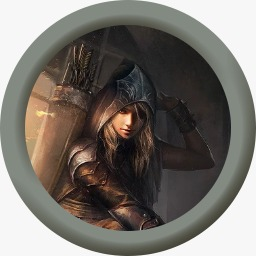

# Party
  
  
- [Party](#party )
  - [Auren](#auren )
    - [Alignment](#alignment )
    - [Health](#health )
      - [Death Saves](#death-saves )
    - [Abilities](#abilities )
    - [Inventory](#inventory )
  - [Burnhard Edward Toast](#burnhard-edward-toast )
    - [Alignment](#alignment-1 )
    - [Health](#health-1 )
      - [Death Saves](#death-saves-1 )
    - [Abilities](#abilities-1 )
    - [Inventory](#inventory-1 )
  - [Fireplum](#fireplum )
    - [Alignment](#alignment-2 )
    - [Health](#health-2 )
      - [Death Saves](#death-saves-2 )
    - [Abilities](#abilities-2 )
    - [Inventory](#inventory-2 )
  - [Cous](#cous )
    - [Alignment](#alignment-3 )
    - [Health](#health-3 )
      - [Death Saves](#death-saves-3 )
    - [Abilities](#abilities-3 )
    - [Inventory](#inventory-3 )
  
## Auren
{width="256px" height="256px"}
  
| Attribute | Value      |
| --------- | ---------- |
| class     | wizard     |
| Race      | Astral elf |
| Gender    | female     |
| Age       | ?          |
| Height    | ?          |
| Weight    | ?          |
| Skin      | ?          |
| Eye       | ?          |
| Hair      | ?          |
  
### Alignment
  
| X       | Lawful | Neutral | Chaotic |
| ------- | ------ | ------- | ------- |
| Good    |        |         |
| Neutral |        |         |         |
| Evil    |        |         |         |
  
  
### Health
  
| Max | Current | Temp |
| --- | ------- | ---- |
| ?  | ?      |
  
Armor Class ?
  
#### Death Saves
- [ ] 
- [ ] 
- [ ] 
- [ ] 
- [ ] 
- [ ] 
  
  
### Abilities
  
| Name         | Proficiency | Modifier |
| ------------ | ----------- | -------- |
| STRength     | ?           | ?       |
| DEXterity    | ?          | ?        |
| CONstitution | ?          | ?        |
| INTelegance  | ?          | ?        |
| WISdom       | ?          | ?        |
| CHArisma     | ?          | ?        |
  
Proficiency bonus +?
  
  
### Inventory
  
| QTY | name | weight(lb.) | cost(gp) |
| --- | ---- | ----------- | -------- |
|     |      |             |          |
  
  
  
  
  
## Burnhard Edward Toast
imp called Mr. Nesbit
{width="256px" height="256px"}
  
| Attribute | Value     |
| --------- | --------- |
| class     | warlock?  |
| Race      | half elf? |
| Gender    | Male      |
| Age       | ?         |
| Height    | ?         |
| Weight    | ?         |
| Skin      | ?         |
| Eye       | ?         |
| Hair      | ?         |
  
### Alignment
  
| X       | Lawful | Neutral | Chaotic |
| ------- | ------ | ------- | ------- |
| Good    |        |         |
| Neutral |        |         |         |
| Evil    |        |         |         |
  
  
### Health
  
| Max | Current | Temp |
| --- | ------- | ---- |
| ?  | ?      |
  
Armor Class ?
  
#### Death Saves
- [ ] 
- [ ] 
- [ ] 
- [ ] 
- [ ] 
- [ ] 
  
  
### Abilities
  
| Name         | Proficiency | Modifier |
| ------------ | ----------- | -------- |
| STRength     | ?           | ?       |
| DEXterity    | ?          | ?        |
| CONstitution | ?          | ?        |
| INTelegance  | ?          | ?        |
| WISdom       | ?          | ?        |
| CHArisma     | ?          | ?        |
  
Proficiency bonus +?
  
  
### Inventory
  
| QTY | name | weight(lb.) | cost(gp) |
| --- | ---- | ----------- | -------- |
|     |      |             |          |
  
  
  
  
  
## Fireplum
{width="256px" height="256px"}
  
| Attribute | Value    |
| --------- | -------- |
| class     | wizard   |
| Race      | tiefling |
| Gender    | Male     |
| Age       | ?        |
| Height    | ?        |
| Weight    | ?        |
| Skin      | ?        |
| Eye       | ?        |
| Hair      | ?        |
  
### Alignment
  
| X       | Lawful | Neutral | Chaotic |
| ------- | ------ | ------- | ------- |
| Good    |        |         |
| Neutral |        |         |         |
| Evil    |        |         |         |
  
  
### Health
  
| Max | Current | Temp |
| --- | ------- | ---- |
| ?  | ?      |
  
Armor Class ?
  
#### Death Saves
- [ ] 
- [ ] 
- [ ] 
- [ ] 
- [ ] 
- [ ] 
  
  
### Abilities
  
| Name         | Proficiency | Modifier |
| ------------ | ----------- | -------- |
| STRength     | ?           | ?       |
| DEXterity    | ?          | ?        |
| CONstitution | ?          | ?        |
| INTelegance  | ?          | ?        |
| WISdom       | ?          | ?        |
| CHArisma     | ?          | ?        |
  
Proficiency bonus +?
  
  
### Inventory
  
| QTY | name | weight(lb.) | cost(gp) |
| --- | ---- | ----------- | -------- |
|     |      |             |          |
  
  
  
  
  
## Cous
{width="256px" height="256px"}
  
| Attribute | Value       |
| --------- | ----------- |
| class     | Druid       |
| Race      | Lizard folk |
| Gender    | Female      |
| Age       | ?           |
| Height    | ?           |
| Weight    | ?           |
| Skin      | ?           |
| Eye       | ?           |
| Hair      | ?           |
  
### Alignment
  
| X       | Lawful | Neutral | Chaotic |
| ------- | ------ | ------- | ------- |
| Good    |        |         |
| Neutral |        |         |         |
| Evil    |        |         |         |
  
  
### Health
  
| Max | Current | Temp |
| --- | ------- | ---- |
| ?  | ?      |
  
Armor Class ?
  
#### Death Saves
- [ ] 
- [ ] 
- [ ] 
- [ ] 
- [ ] 
- [ ] 
  
  
### Abilities
  
| Name         | Proficiency | Modifier |
| ------------ | ----------- | -------- |
| STRength     | ?           | ?       |
| DEXterity    | ?          | ?        |
| CONstitution | ?          | ?        |
| INTelegance  | ?          | ?        |
| WISdom       | ?          | ?        |
| CHArisma     | ?          | ?        |
  
Proficiency bonus +?
  
  
### Inventory
  
| QTY | name | weight(lb.) | cost(gp) |
| --- | ---- | ----------- | -------- |
|     |      |             |          |
  
  
  
  